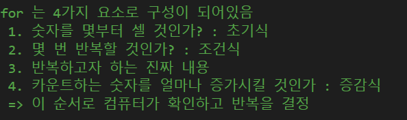
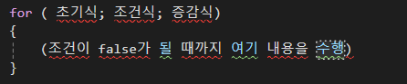

# Ⅲ. 반복문for

### 1. for문
---

**※for문의 기본형태**

![[{D064C3E3-57A9-4B3B-BDB0-1D4A12F01F6D}.png]]

▶ 증감식을 따라 counter가 1회 시행때마다 1씩 증가하며 조건식이 false가 나오면 반복을 종료함

### 2. 전위연산/후위연산
**※전위연산(++a):** 먼저 a+1을 하고 수행을 하는 것

**※후위연산(a++):** 먼저 a로 작업을 수행하고 마지막에 a+1을 하는 것

> ## 🤔 마무리
> 차후 최적화와 가장 밀접한 연관성이 존재하는 문법이다.
  모든 내용을 반복한다는 것 자체가 반복횟수가 증가할수록 연산의 양이 급격하게 많아지다보니, **최적화를 위해서라면 줄일 수 있는 만큼 반복문은 최소화시키는 것이 반드시 필요하다.**
  코딩 테스트를 하면서 계산 시간 초과를 맛 보고 나니, 왜 남용하면 안 되는지 뼈저리게 느낄 수 있었다.(와중에 부트캠프 시험이었는데....)